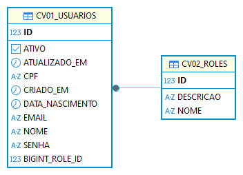

# CV Authentication Service

Data de referencia deste documento: **2026-09-05**.

## Visao geral

O `cv-authentication-service` e uma API REST em Spring Boot para autenticacao e gerenciamento de usuarios.

Principais pontos:
- Autenticacao com JWT (`/api/auth/login`).
- Cadastro de usuarios restrito a perfil administrador.
- Gerenciamento de usuarios (listar, buscar, atualizar, ativar/desativar, deletar) com controle de permissao.
- Banco H2 para desenvolvimento/testes.

## Como a aplicacao funciona

### Fluxo de autenticacao
1. O cliente envia email e senha para `POST /api/auth/login`.
2. A API valida as credenciais e retorna um token JWT.
3. O cliente envia `Authorization: Bearer <token>` nas demais rotas protegidas.

### Regras de permissao (resumo)
- `POST /api/auth/login`: publico.
- `POST /api/auth/register`: apenas `ADMINISTRADOR`.
- Leituras de usuarios (`GET /api/usuarios`, `GET /api/usuarios/{id}`, `GET /api/usuarios/email/{email}`): perfis autenticados com permissao da aplicacao.
- Acoes administrativas como ativar, desativar e deletar usuario: apenas `ADMINISTRADOR`.

### Padrao de erro da API
Respostas de erro sao padronizadas com campos:
- `descricao`
- `statusCode`
- `solucao`
- `dataHora`

## Como executar localmente

Pre-requisitos:
- Java 21
- Maven Wrapper do projeto (`mvnw.cmd`)

Comandos (Windows PowerShell):

```powershell
Set-Location "C:\Users\Pedro\IdeaProjects\cv-authentication-service"
.\mvnw.cmd spring-boot:run
```

A aplicacao sobe na porta `8080` com contexto `/api`.

Base URL local:
- `http://localhost:8080/api`

## Como usar rapidamente

1. Fazer login em `POST /api/api/auth/login` (de acordo com o contexto atual da aplicacao).
2. Copiar o token retornado.
3. Chamar as rotas protegidas enviando o header `Authorization`.

Exemplo de login:

```json
{
  "email": "admin@classvision.com",
  "senha": "admin123456"
}
```

## Banco de dados (H2)

Configuracao atual em `src/main/resources/application.properties` usa H2 em arquivo.

Arquivo de banco esperado:
- `data/cv-auth-db.mv.db`

Observacao:
- Se houver erro de arquivo em uso (lock), feche conexoes concorrentes (ex.: DBeaver ou outra instancia da aplicacao).

## Conteudo da pasta `docs`

Estrutura atual:
- `docs/collections/postman/`
  - `CV-Authentication-Service-H2.postman_collection.json`
  - `CV-Authentication-Service-H2.postman_environment.json`
- `docs/database/`
  - `ddl/`
  - `diagram/`
- `docs/secret/`
  - `Variáveis de Ambiente - CV Authentication.zip`

### Para que serve cada item
- **Collection Postman**: conjunto de requests prontos para testar login e rotas de usuarios.
- **Environment Postman**: variaveis como `baseUrl`, `apiPrefix`, `authToken`, `usuarioId` e `usuarioEmail`.
- **`docs/database/ddl`**: scripts DDL (create/alter) para referencia de estrutura de tabelas.
- **`docs/database/diagram`**: diagramas do banco (ex.: ERD exportado do DBeaver).
- **`docs/secret`**: artefatos de configuracao local (ex.: pacote com variaveis de ambiente).

### Diagrama do banco



### Boas praticas para secrets
- Nao commitar valores reais de segredo (JWT, senha de banco, chaves de API).
- Preferir variaveis de ambiente e referenciar no `application.properties` com `${NOME_VARIAVEL}`.
- Se compartilhar o zip de exemplo, remover/mascarar segredos antes.

## Notas finais

- Projeto voltado para ambiente de desenvolvimento e testes com H2.
- Para producao, recomenda-se banco dedicado, gestao de segredo JWT por variavel de ambiente/cofre e pipeline de migracoes.

